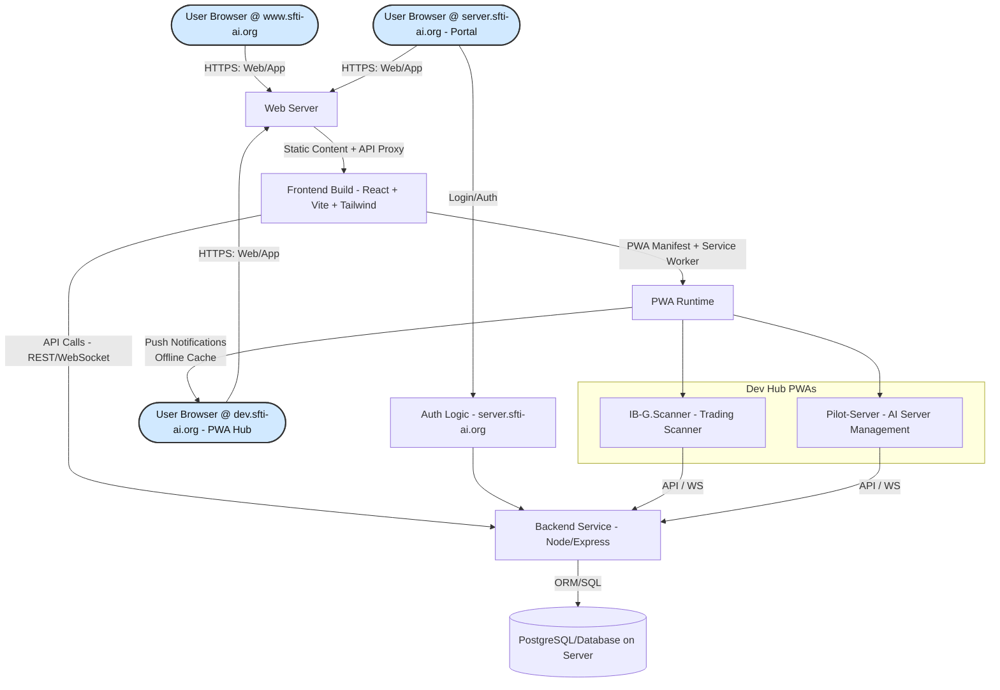

**SFTi-Web.Template Full Structure**

```txt
SFTi-Website/
│
├── LICENSE.md
├── README.md
├── manifest.json
├── sw.js
│
├── About Us
│   ├── CODE_OF_CONDUCT.md
│   ├── CONTRIBUTING.md
│   ├── Cover_Letter.docx
│   ├── FOUNDER_LOG.md
│   ├── FOUNDER_STATEMENT.md
│   ├── Final_Leg_v1.0.3.md
│   ├── GREMLINGPT-v1.0.3_PATCH_PLAN.md
│   ├── GREMLINGPT_AUTONOMY_REPORT.md
│   ├── LICENSE.md
│   ├── OPEN_FUNDING_PROPOSAL.md
│   ├── OpenAI.md
│   ├── Resume.pdf
│   ├── SECURITY.md
│   └── WHY_GREMLINGPT.md
│
├── Documentation
│   ├── COMPONENT_SYSTEM.md
│   ├── HIDDEN_CONFIGURATIONS.md
│   ├── QUICK_REFERENCE.md
│   ├── SFTi.Web.README.md
│   └── STRUCTURE.md
│
├── badges
│   ├── G.H.badge.svg
│   ├── G.I.badge.svg
│   ├── L.W.badge.svg
│   ├── M.P.badge.svg
│   ├── R.S.badge.svg
│   ├── README.md
│   ├── Z.P.badge.svg
│   ├── ai_architect.svg
│   ├── bitcoin.sponsor.svg
│   ├── cashapp.sponsor.svg
│   ├── chime.sponsor.svg
│   ├── ethereum.sponsor.svg
│   ├── full_stack_dev.svg
│   ├── g.h.svg
│   ├── git.sponsor.svg
│   ├── kofi.sponsor.svg
│   ├── patreon.sponsor.svg
│   ├── paypal.sponsor.svg
│   ├── prompt_blacksmith.svg
│   └── purdue.banner.svg
│
├── build
│   ├── DEVELOPMENT.md
│   ├── build.sh
│   ├── build_dashboard_html.py
│   ├── components.json
│   ├── dev-server.js
│   ├── force-refresh.js
│   ├── package-lock.json
│   ├── package.json
│   ├── script.js
│   ├── setup.cfg
│   ├── tailwind.config.js
│   └── vite.config.ts
│
├── dev.sfti-ai.org
│   ├── IB-G.Scanner
│   │   ├── Documentation
│   │   │   ├── ARCHITECTURE.md
│   │   │   ├── DEPLOYMENT.md
│   │   │   ├── MILESTONES.md
│   │   │   ├── PRD.md
│   │   │   ├── PWA-DEPLOYMENT.md
│   │   │   ├── README.md
│   │   │   └── SECURITY.md
│   │   ├── LICENSE.md
│   │   ├── README.md
│   │   ├── components.json
│   │   ├── eslint.config.js
│   │   ├── ibkr-gateway
│   │   │   └── clientportal.gw.zip
│   │   ├── index.html
│   │   ├── install.sh
│   │   ├── package-lock.json
│   │   ├── package.json
│   │   ├── public
│   │   │   ├── auth
│   │   │   │   └── callback.html
│   │   │   ├── manifest.json
│   │   │   └── sw.js
│   │   ├── runtime.config.json
│   │   ├── scripts
│   │   │   ├── README.md
│   │   │   ├── install.bat
│   │   │   ├── install.ps1
│   │   │   ├── server.js
│   │   │   ├── setup-docker.sh
│   │   │   └── update-sw.js
│   │   ├── src
│   │   │   ├── App.tsx
│   │   │   ├── ErrorFallback.tsx
│   │   │   ├── assets
│   │   │   │   ├── images
│   │   │   │   │   ├── graph-icon-512.png
│   │   │   │   │   └── icon.png
│   │   │   │   └── stock-chart-icon.svg
│   │   │   ├── components
│   │   │   │   ├── AISearch.tsx
│   │   │   │   ├── AITopPicks.tsx
│   │   │   │   ├── AlertsManager.tsx
│   │   │   │   ├── FilterPanel.tsx
│   │   │   │   ├── Footer.tsx
│   │   │   │   ├── IBKRChart.tsx
│   │   │   │   ├── IBKRSettings.tsx
│   │   │   │   ├── IBKRSettingsBrowser.tsx
│   │   │   │   ├── MarketInsights.tsx
│   │   │   │   ├── MarketStatus.tsx
│   │   │   │   ├── OfflineBanner.tsx
│   │   │   │   ├── SFTiTop10.tsx
│   │   │   │   ├── ScannerTable.tsx
│   │   │   │   ├── StockChart.tsx
│   │   │   │   ├── TabSelector.tsx
│   │   │   │   ├── TabSystem.tsx
│   │   │   │   ├── TradingViewChart.tsx
│   │   │   │   └── ui
│   │   │   │       ├── accordion.tsx
│   │   │   │       ├── alert-dialog.tsx
│   │   │   │       ├── alert.tsx
│   │   │   │       ├── aspect-ratio.tsx
│   │   │   │       ├── avatar.tsx
│   │   │   │       ├── badge.tsx
│   │   │   │       ├── breadcrumb.tsx
│   │   │   │       ├── button.tsx
│   │   │   │       ├── calendar.tsx
│   │   │   │       ├── card.tsx
│   │   │   │       ├── carousel.tsx
│   │   │   │       ├── chart.tsx
│   │   │   │       ├── checkbox.tsx
│   │   │   │       ├── collapsible.tsx
│   │   │   │       ├── command.tsx
│   │   │   │       ├── context-menu.tsx
│   │   │   │       ├── dialog.tsx
│   │   │   │       ├── drawer.tsx
│   │   │   │       ├── dropdown-menu.tsx
│   │   │   │       ├── form.tsx
│   │   │   │       ├── hover-card.tsx
│   │   │   │       ├── input-otp.tsx
│   │   │   │       ├── input.tsx
│   │   │   │       ├── label.tsx
│   │   │   │       ├── menubar.tsx
│   │   │   │       ├── navigation-menu.tsx
│   │   │   │       ├── pagination.tsx
│   │   │   │       ├── popover.tsx
│   │   │   │       ├── progress.tsx
│   │   │   │       ├── radio-group.tsx
│   │   │   │       ├── resizable.tsx
│   │   │   │       ├── scroll-area.tsx
│   │   │   │       ├── select.tsx
│   │   │   │       ├── separator.tsx
│   │   │   │       ├── sheet.tsx
│   │   │   │       ├── sidebar.tsx
│   │   │   │       ├── skeleton.tsx
│   │   │   │       ├── slider.tsx
│   │   │   │       ├── sonner.tsx
│   │   │   │       ├── switch.tsx
│   │   │   │       ├── table.tsx
│   │   │   │       ├── tabs.tsx
│   │   │   │       ├── textarea.tsx
│   │   │   │       ├── toggle-group.tsx
│   │   │   │       ├── toggle.tsx
│   │   │   │       └── tooltip.tsx
│   │   │   ├── hooks
│   │   │   │   └── use-mobile.ts
│   │   │   ├── index.css
│   │   │   ├── lib
│   │   │   │   ├── README.md
│   │   │   │   ├── aiPatterns.ts
│   │   │   │   ├── aiSearch.ts
│   │   │   │   ├── alerts.ts
│   │   │   │   ├── ibkr-browser.ts
│   │   │   │   ├── ibkr-gateway-browser.ts
│   │   │   │   ├── ibkr.ts
│   │   │   │   ├── market.ts
│   │   │   │   ├── offline.ts
│   │   │   │   └── utils.ts
│   │   │   ├── main.css
│   │   │   ├── main.tsx
│   │   │   ├── prd.md
│   │   │   ├── styles
│   │   │   │   └── theme.css
│   │   │   ├── types
│   │   │   │   └── index.ts
│   │   │   └── vite-end.d.ts
│   │   ├── tailwind.config.js
│   │   ├── theme.json
│   │   ├── tsconfig.json
│   │   └── vite.config.ts
│   ├── Pilot-Server
│   │   ├── LICENSE
│   │   ├── PRD.md
│   │   ├── README.md
│   │   ├── SECURITY.md
│   │   ├── components.json
│   │   ├── docs
│   │   │   └── s
│   │   ├── eslint.config.js
│   │   ├── index.html
│   │   ├── package-lock.json
│   │   ├── package.json
│   │   ├── runtime.config.json
│   │   ├── scripts
│   │   │   ├── validate-api-usage.cjs
│   │   │   ├── validate-error-handling.cjs
│   │   │   └── validate-imports.cjs
│   │   ├── server.js
│   │   ├── src
│   │   │   ├── App.tsx
│   │   │   ├── ErrorFallback.tsx
│   │   │   ├── components
│   │   │   │   ├── AuthGuard.tsx
│   │   │   │   ├── ChatHeader.tsx
│   │   │   │   ├── ChatMessages.tsx
│   │   │   │   ├── ChatSidebar.tsx
│   │   │   │   ├── ErrorBoundary.tsx
│   │   │   │   ├── GitHubCallback.tsx
│   │   │   │   ├── MessageBubble.tsx
│   │   │   │   ├── MessageInput.tsx
│   │   │   │   ├── ModelBubble.tsx
│   │   │   │   ├── ModelPermissionStatus.tsx
│   │   │   │   ├── SettingsDialog.tsx
│   │   │   │   ├── ThemeProvider.tsx
│   │   │   │   ├── ThemeToggle.tsx
│   │   │   │   └── ui
│   │   │   │       ├── accordion.tsx
│   │   │   │       ├── alert-dialog.tsx
│   │   │   │       ├── alert.tsx
│   │   │   │       ├── aspect-ratio.tsx
│   │   │   │       ├── avatar.tsx
│   │   │   │       ├── badge.tsx
│   │   │   │       ├── breadcrumb.tsx
│   │   │   │       ├── button.tsx
│   │   │   │       ├── calendar.tsx
│   │   │   │       ├── card.tsx
│   │   │   │       ├── carousel.tsx
│   │   │   │       ├── chart.tsx
│   │   │   │       ├── checkbox.tsx
│   │   │   │       ├── collapsible.tsx
│   │   │   │       ├── command.tsx
│   │   │   │       ├── context-menu.tsx
│   │   │   │       ├── dialog.tsx
│   │   │   │       ├── drawer.tsx
│   │   │   │       ├── dropdown-menu.tsx
│   │   │   │       ├── form.tsx
│   │   │   │       ├── hover-card.tsx
│   │   │   │       ├── input-otp.tsx
│   │   │   │       ├── input.tsx
│   │   │   │       ├── label.tsx
│   │   │   │       ├── menubar.tsx
│   │   │   │       ├── navigation-menu.tsx
│   │   │   │       ├── pagination.tsx
│   │   │   │       ├── popover.tsx
│   │   │   │       ├── progress.tsx
│   │   │   │       ├── radio-group.tsx
│   │   │   │       ├── resizable.tsx
│   │   │   │       ├── scroll-area.tsx
│   │   │   │       ├── select.tsx
│   │   │   │       ├── separator.tsx
│   │   │   │       ├── sheet.tsx
│   │   │   │       ├── sidebar.tsx
│   │   │   │       ├── skeleton.tsx
│   │   │   │       ├── slider.tsx
│   │   │   │       ├── sonner.tsx
│   │   │   │       ├── switch.tsx
│   │   │   │       ├── table.tsx
│   │   │   │       ├── tabs.tsx
│   │   │   │       ├── textarea.tsx
│   │   │   │       ├── toggle-group.tsx
│   │   │   │       ├── toggle.tsx
│   │   │   │       └── tooltip.tsx
│   │   │   ├── hooks
│   │   │   │   ├── use-auth.ts
│   │   │   │   ├── use-chat.ts
│   │   │   │   ├── use-mobile.ts
│   │   │   │   └── use-theme.ts
│   │   │   ├── index.css
│   │   │   ├── lib
│   │   │   │   ├── types.ts
│   │   │   │   └── utils.ts
│   │   │   ├── main.css
│   │   │   ├── main.tsx
│   │   │   ├── prd.md
│   │   │   ├── styles
│   │   │   │   ├── lib
│   │   │   │   │   ├── types.ts
│   │   │   │   │   └── utils.ts
│   │   │   │   └── theme.css
│   │   │   └── vite-end.d.ts
│   │   ├── tailwind.config.js
│   │   ├── theme.json
│   │   ├── tsconfig.json
│   │   └── vite.config.ts
│   ├── dev-script.js
│   ├── index.html
│   ├── manifest.json
│   ├── styles
│   │   ├── dev-styles.css
│   │   └── dev.tailwind.css
│   └── sw.js
│
├── develop.site.launch
│   ├── README.md
│   ├── setup-dev.sh
│   └── static-server.js
│
├── docs
│   ├── A.D.svg
│   │   ├── README.md
│   │   ├── assets
│   │   │   └── ascenddocs-of-govseverance-card.svg
│   │   ├── package-lock.json
│   │   ├── package.json
│   │   └── scripts
│   │       └── generate-ascenddocs-of-govseverance.mjs
│   ├── A.I.svg
│   │   ├── README.md
│   │   ├── assets
│   │   │   └── ascend-institute-card.svg
│   │   ├── package-lock.json
│   │   ├── package.json
│   │   └── scripts
│   │       └── generate-ascend-institute.mjs
│   ├── A.N.svg
│   │   ├── README.md
│   │   ├── assets
│   │   │   └── ascendnet-card.svg
│   │   ├── package-lock.json
│   │   ├── package.json
│   │   └── scripts
│   │       └── generate-ascendnet.mjs
│   ├── D.B.svg
│   │   ├── README.md
│   │   ├── assets
│   │   │   └── dragon-boot-card.svg
│   │   ├── package-lock.json
│   │   ├── package.json
│   │   └── scripts
│   │       └── generate-dragon-boot.mjs
│   ├── G.C.svg
│   │   ├── README.md
│   │   ├── assets
│   │   │   └── godcore-card.svg
│   │   ├── package-lock.json
│   │   ├── package.json
│   │   └── scripts
│   │       └── generate-godcore.mjs
│   ├── G.G.svg
│   │   ├── README.md
│   │   ├── assets
│   │   │   └── gremlingpt-card.svg
│   │   ├── package-lock.json
│   │   ├── package.json
│   │   └── scripts
│   │       └── generate-gremlingpt.mjs
│   ├── G.M.svg
│   │   ├── README.md
│   │   ├── assets
│   │   │   └── gremlin-mcp-scrap-card.svg
│   │   ├── package-lock.json
│   │   ├── package.json
│   │   └── scripts
│   │       └── generate-gremlin-mcp-scrap.mjs
│   ├── G.S.svg
│   │   ├── assets
│   │   │   └── gremlin-shadtail-trader-card.svg
│   │   ├── package-lock.json
│   │   ├── package.json
│   │   └── scripts
│   │       └── generate-gremlin-shadtail-trader.mjs
│   ├── IB.G.svg
│   │   ├── assets
│   │   │   └── ib-g-scanner-card.svg
│   │   ├── package-lock.json
│   │   ├── package.json
│   │   └── scripts
│   │       └── generate-ib-g-scanner.mjs
│   ├── M.M.svg
│   │   ├── assets
│   │   │   └── mobile-mirror-card.svg
│   │   ├── package-lock.json
│   │   ├── package.json
│   │   └── scripts
│   │       └── generate-mobile-mirror.mjs
│   ├── Medium.papers.svg
│   │   ├── README.md
│   │   ├── breaking-the-loop.svg
│   │   ├── building-an-autonomous-aidriven-ide-pipeline.svg
│   │   ├── burj-khalifa-and-the-resonant-lie.svg
│   │   ├── capital-capture.svg
│   │   ├── contribution-revolution.svg
│   │   ├── designing-gremlingpt.svg
│   │   ├── garbage-in-profits-out.svg
│   │   ├── gremlingpts-structural-extraction.svg
│   │   ├── how-icann-stole-the-internet.svg
│   │   ├── its-not-the-ai-but-the-system.svg
│   │   ├── open-isnt-open.svg
│   │   ├── selfforking-ai-and-the-mechanic-from-kansas.svg
│   │   ├── the-ai-revolution-that-wasnt.svg
│   │   ├── the-disappearance-of-the-openai-mcp-repo.svg
│   │   ├── the-govseverance-doctrine.svg
│   │   ├── the-journey-to-snhu.svg
│   │   ├── the-lessons-i-am-learning.svg
│   │   ├── the-pivot-that-broke-productmarket-fit.svg
│   │   ├── the-wealth-power-imbalance-and-economic-servitude.svg
│   │   └── while-dubai-built-control-i-built-an-autonomous-mind.svg
│   ├── P.S.svg
│   │   ├── assets
│   │   │   └── pilot-server-card.svg
│   │   ├── package-lock.json
│   │   ├── package.json
│   │   └── scripts
│   │       └── generate-pilot-server.mjs
│   ├── README.md
│   ├── S.S.svg
│   │   ├── assets
│   │   │   └── statik-server-card.svg
│   │   ├── package-lock.json
│   │   ├── package.json
│   │   └── scripts
│   │       └── generate-statik-server.mjs
│   ├── SVG.README.md
│   ├── Zenodo.papers.svg
│   │   ├── README.md
│   │   ├── economic-sovereignty-through-decentralized-ai.svg
│   │   ├── rise-of-recursive-autonomous-cognitive-ai-systems.svg
│   │   └── the-gremlingpt-architecture-localized-recursive-ai.svg
│   ├── builder.script
│   │   ├── README.md
│   │   ├── builder.script.mjs
│   │   ├── medium-builder.mjs
│   │   └── zenodo-builder.mjs
│   ├── c.svg
│   │   ├── assets
│   │   │   └── crimson-flow.svg
│   │   ├── package-lock.json
│   │   ├── package.json
│   │   └── scripts
│   │       └── generate-crimson-flow.mjs
│   ├── g.svg
│   │   ├── assets
│   │   │   └── github-profile.svg
│   │   ├── package-lock.json
│   │   ├── package.json
│   │   └── scripts
│   │       └── generate-github-profile.mjs
│   ├── i.svg
│   │   ├── README.md
│   │   └── assets
│   │       └── institute-header.svg
│   ├── r.svg
│   │   ├── assets
│   │   │   └── repo-slide.svg
│   │   ├── package-lock.json
│   │   ├── package.json
│   │   └── scripts
│   │       └── generate-repo-slide.mjs
│   ├── s.svg
│   │   ├── assets
│   │   │   └── streak.svg
│   │   ├── package-lock.json
│   │   ├── package.json
│   │   └── scripts
│   │       └── build-streak.mjs
│   ├── sdks.svg
│   │   ├── README.md
│   │   ├── assets
│   │   │   └── statik.title.svg
│   │   └── scripts
│   │       └── generate-sdks-card.mjs
│   ├── t.svg
│   │   ├── assets
│   │   │   └── trophies.svg
│   │   ├── package-lock.json
│   │   ├── package.json
│   │   └── scripts
│   │       └── build-trophies.mjs
│   └── v.svg
│       ├── assets
│       │   └── pv-traffic.svg
│       ├── package-lock.json
│       ├── package.json
│       └── scripts
│           └── build-pv.mjs
│
├── server.sfti-ai.org
│   ├── index.html
│   ├── manifest.json
│   ├── server-script.js
│   ├── styles
│   │   ├── server-styles.css
│   │   └── server.tailwind.css
│   └── sw.js
│
├── src
│   ├── components
│   │   ├── dev.c
│   │   │   ├── footer.js
│   │   │   └── navbar.js
│   │   ├── global.c
│   │   │   ├── card.js
│   │   │   ├── footer.js
│   │   │   └── navbar-example.html
│   │   ├── server.c
│   │   │   ├── footer.js
│   │   │   └── navbar.js
│   │   ├── sfti-component-system.js
│   │   ├── ui
│   │   │   ├── button.tsx
│   │   │   ├── card.tsx
│   │   │   ├── mobile-navigation.tsx
│   │   │   ├── navbar.tsx
│   │   │   └── sheet.tsx
│   │   └── www.c
│   │       ├── footer.js
│   │       └── navbar.js
│   ├── lib
│   │   └── utils.ts
│   ├── public
│   │   ├── dragon.png
│   │   ├── web.contact.bkg.png
│   │   ├── web.projects.bkg.png
│   │   └── web.pwa.icon.png
│   └── styles
│       ├── components
│       │   ├── navbar.css
│       │   └── navbar.js
│       ├── dev.css
│       ├── globals.css
│       ├── main.css
│       └── server.css
│
└── www.sfti-ai.org
    ├── index.html
    ├── script.js
    └── styles
        ├── custom.css
        ├── main.tailwind.css
        ├── scrollFX.js
        └── styles.css

110 directories, 426 files
```

---

**SFTi *Website & PWA* System – Architecture Overview**

This diagram illustrates the main architecture for the [StatikFinTech, LLC Website](https://sfti-ai.org), its built in PWA hub, secure portal, and PostgreSQL integration on our server.



## Key Components

- **[www.sfti-ai.org](https://www.sfti-ai.org)**: Corporate/marketing website, React-based, static and dynamic content.
- **[dev.sfti-ai.org](https://dev.sfti-ai.org)**: PWA hub for launching/managing apps like IB-G.Scanner & Pilot-Server.
- **[server.sfti-ai.org](https://server.sfti-ai.org)**: Secure portal for authentication and account management.
- **PWAs**: Independent React/TypeScript apps built with Vite, using shadcn/ui & Tailwind, deployed under the dev or server domains.
- **Backend Service**: (Node/Express) Handles API, WebSockets, authentication, and business logic.
- **PostgreSQL Database**: Central data store, hosted on your server.

## Tech Stack Overview

- **Frontend**: React 19, shadcn/ui, Tailwind CSS, Service Workers for PWA features.
- **Backend**: Node.js, Express, WebSocket, ORM (e.g., Prisma or Sequelize), API endpoints.
- **Database**: PostgreSQL (on server).
- **Build Tool**: Vite 6+.
- **Deployment**: Static files to subdomains, API/backend and DB reside on the server.

> [!IMPORTANT]
>
> Updates will be made to this architecture diagram as the system evolves and/or when domains/PWAs/services are added or changed.
