**StatikFinTech LLC - GitHub Profile Repository Structure**

> [!NOTE]
>
> This is the official GitHub profile repository for `statikfintechllc` featuring automated SVG generation, dynamic badges, GitHub Actions workflows, and comprehensive project showcases.

```txt
statikfintechllc/
│
├── .github/
│   ├── workflows/                      # GitHub Actions for automated SVG generation
│   │   ├── update-profile-streak.yml   # Git stats: Contribution streak automation
│   │   ├── update-profile-trophies.yml # Git stats: Trophy/achievement generation  
│   │   ├── update-profile-views.yml    # Git stats: Profile view tracking
│   │   ├── update-crimson-flow.yml     # Git stats: Activity graph automation
│   │   ├── update-github-profile.yml   # Git stats: Profile SVG generation
│   │   ├── update-repo-slide.yml       # Repo stats: Repository showcase cards
│   │   ├── update-build-dates.yml      # Publication build automation
│   │   ├── update-gremlingpt-card.yml  # Project: GremlinGPT showcase
│   │   ├── update-dragon-boot-card.yml # Project: Dragon Boot showcase
│   │   ├── update-godcore-card.yml     # Project: GodCore showcase
│   │   ├── update-statik-server-card.yml # Project: Statik Server showcase
│   │   ├── update-ib-g-scanner-card.yml  # Project: IB-G Scanner showcase
│   │   ├── update-pilot-server-card.yml  # Project: Pilot Server showcase
│   │   ├── update-gremlin-mcp-scrap-card.yml    # Project: MCP Scrap showcase
│   │   ├── update-gremlin-shadtail-trader-card.yml # Project: ShadTail Trader
│   │   ├── update-mobile-mirror-card.yml # Project: Mobile Mirror showcase
│   │   ├── update-ascend-institute-card.yml # Project: Ascend Institute showcase
│   │   ├── update-ascendnet-card.yml    # Project: AscendNet showcase
│   │   └── update-ascenddocs-of-govseverance-card.yml # Project: AscendDocs showcase
│   ├── AI_DEVELOPMENT_GUIDELINES.md
│   ├── COPILOT_INSTRUCTIONS.md
│   ├── FUNDING.yml
│   ├── HIDDEN_CONFIGURATIONS.md
│   ├── LICENSE.md
│   ├── QUICK_REFERENCE.md
│   ├── STRUCTURE.md
│   ├── copilot-instructions.md
│   └── validate-instructions.md
│
├── About Us/                          # Company documentation and legal
│   ├── CODE_OF_CONDUCT.md
│   ├── CONTRIBUTING.md
│   ├── Cover_Letter.docx
│   ├── FOUNDER_LOG.md
│   ├── FOUNDER_STATEMENT.md
│   ├── Final_Leg_v1.0.3.md
│   ├── GREMLINGPT-v1.0.3_PATCH_PLAN.md
│   ├── GREMLINGPT_AUTONOMY_REPORT.md
│   ├── LICENSE.md
│   ├── OPEN_FUNDING_PROPOSAL.md
│   ├── OpenAI.md
│   ├── Resume.pdf
│   ├── SECURITY.md
│   └── WHY_GREMLINGPT.md
│
├── Documentation/                      # Technical documentation
│   ├── COMPONENT_SYSTEM.md
│   ├── HIDDEN_CONFIGURATIONS.md
│   ├── QUICK_REFERENCE.md
│   ├── SFTi.Web.README.md
│   └── STRUCTURE.md                    # This file
│
├── badges/                            # Custom SVG badges and sponsors
│   ├── G.H.badge.svg                  # GitHub badge
│   ├── G.I.badge.svg                  # General info badge
│   ├── L.W.badge.svg                  # LinkedIn/work badge
│   ├── M.P.badge.svg                  # Medium/publications badge
│   ├── R.S.badge.svg                  # Research/science badge
│   ├── Z.P.badge.svg                  # Zenodo publications badge
│   ├── ai_architect.svg               # Professional role badge
│   ├── full_stack_dev.svg             # Technical skill badge
│   ├── prompt_blacksmith.svg          # AI expertise badge
│   ├── g.h.svg                        # GitHub integration badge
│   ├── purdue.banner.svg              # Educational institution badge
│   ├── bitcoin.sponsor.svg            # Cryptocurrency sponsor badge
│   ├── cashapp.sponsor.svg            # CashApp sponsor badge
│   ├── chime.sponsor.svg              # Chime sponsor badge
│   ├── ethereum.sponsor.svg           # Ethereum sponsor badge
│   ├── git.sponsor.svg                # Git sponsor badge
│   ├── kofi.sponsor.svg               # Ko-fi sponsor badge
│   ├── patreon.sponsor.svg            # Patreon sponsor badge
│   ├── paypal.sponsor.svg             # PayPal sponsor badge
│   └── README.md
│
├── build/                             # Build automation and configuration
│   ├── .env.development               # Development environment variables
│   ├── DEVELOPMENT.md                 # Development guidelines
│   ├── README.md                      # Build system documentation
│   ├── build-all.sh                   # Master build script
│   ├── build.sh                       # Individual build script
│   ├── build_dashboard_html.py        # Dashboard generation
│   ├── force-refresh.js               # Cache busting utility
│   ├── script.js                      # Build helper scripts
│   ├── setup.cfg                      # Python setup configuration
│   └── tailwind.config.js             # Tailwind CSS configuration
│
├── dev.sfti-ai.org/                   # Development environment applications
│   ├── IB-G.Scanner/                  # Interactive Brokers scanner PWA
│   │   ├── .github/                   # GitHub configuration
│   │   ├── .playwright-mcp/           # MCP testing artifacts
│   │   ├── Documentation/             # Project documentation
│   │   ├── ibkr-gateway/              # IBKR gateway files
│   │   ├── public/                    # Static assets
│   │   ├── scripts/                   # Deployment scripts
│   │   ├── src/                       # React/TypeScript source
│   │   └── [config files]             # Build and configuration files
│   ├── Pilot-Server/                  # AI server management interface
│   │   ├── .github/                   # GitHub configuration
│   │   ├── scripts/                   # Validation and build scripts
│   │   ├── src/                       # React/TypeScript source
│   │   └── [config files]             # Build and configuration files
│   ├── styles/                        # Shared stylesheets
│   ├── dev-script.js                  # Development utilities
│   └── index.html                     # Development hub entry point
│
├── docs/                              # Automated SVG generation system
│   ├── builder.script/                # Publication card automation
│   │   ├── README.md                  # Builder documentation
│   │   ├── builder.script.mjs         # Main build automation
│   │   ├── medium-builder.mjs         # Medium article cards
│   │   └── zenodo-builder.mjs         # Zenodo paper cards
│   │
│   │── Git Stats SVG Generators ──────────────────────────────────────
│   ├── c.svg/                         # Crimson Flow: GitHub activity graph
│   │   ├── assets/crimson-flow.svg    # Generated activity visualization
│   │   ├── package.json               # Node.js dependencies
│   │   └── scripts/generate-crimson-flow.mjs  # GraphQL-based generator
│   ├── s.svg/                         # Streak: Contribution streak tracking
│   │   ├── assets/streak.svg          # Generated streak badge
│   │   ├── package.json               # Node.js dependencies
│   │   └── scripts/build-streak.mjs   # Streak calculation logic
│   ├── t.svg/                         # Trophies: Achievement visualization
│   │   ├── assets/trophies.svg        # Generated trophy display
│   │   ├── package.json               # Node.js dependencies
│   │   └── scripts/build-trophies.mjs # Achievement tracking
│   ├── v.svg/                         # Views: Profile traffic analytics
│   │   ├── assets/pv-traffic.svg      # Generated view statistics
│   │   ├── package.json               # Node.js dependencies
│   │   └── scripts/build-pv.mjs       # Traffic tracking logic
│   ├── g.svg/                         # GitHub Profile: Complete profile SVG
│   │   ├── assets/github-profile.svg  # Generated profile card
│   │   ├── package.json               # Node.js dependencies
│   │   └── scripts/generate-github-profile.mjs # Profile aggregation
│   │
│   │── Repo Stats SVG Generators ─────────────────────────────────────
│   ├── r.svg/                         # Repo Slide: Repository showcase carousel
│   │   ├── assets/repo-slide.svg      # Generated repository cards
│   │   ├── package.json               # Node.js dependencies
│   │   └── scripts/generate-repo-slide.mjs # Repository stats aggregation
│   │
│   │── Project Showcase SVG Generators ──────────────────────────────
│   ├── G.G.svg/                       # GremlinGPT project card
│   │   ├── assets/gremlingpt-card.svg # Generated project showcase
│   │   ├── package.json               # Node.js dependencies
│   │   └── scripts/generate-gremlingpt.mjs # Project stats integration
│   ├── D.B.svg/                       # Dragon Boot project card
│   │   ├── assets/dragon-boot-card.svg # Generated project showcase
│   │   ├── package.json               # Node.js dependencies
│   │   └── scripts/generate-dragon-boot.mjs # Project stats integration
│   ├── G.C.svg/                       # GodCore project card
│   │   ├── assets/godcore-card.svg    # Generated project showcase
│   │   ├── package.json               # Node.js dependencies
│   │   └── scripts/generate-godcore.mjs # Project stats integration
│   ├── S.S.svg/                       # Statik Server project card
│   │   ├── assets/statik-server-card.svg # Generated project showcase
│   │   ├── package.json               # Node.js dependencies
│   │   └── scripts/generate-statik-server.mjs # Project stats integration
│   ├── IB.G.svg/                      # IB-G Scanner project card
│   │   ├── assets/ib-g-scanner-card.svg # Generated project showcase
│   │   ├── package.json               # Node.js dependencies
│   │   └── scripts/generate-ib-g-scanner.mjs # Project stats integration
│   ├── P.S.svg/                       # Pilot Server project card
│   │   ├── assets/pilot-server-card.svg # Generated project showcase
│   │   ├── package.json               # Node.js dependencies
│   │   └── scripts/generate-pilot-server.mjs # Project stats integration
│   ├── G.M.svg/                       # Gremlin MCP Scrap project card
│   │   ├── assets/gremlin-mcp-scrap-card.svg # Generated project showcase
│   │   ├── package.json               # Node.js dependencies
│   │   └── scripts/generate-gremlin-mcp-scrap.mjs # Project stats integration
│   ├── G.S.svg/                       # Gremlin ShadTail Trader project card
│   │   ├── assets/gremlin-shadtail-trader-card.svg # Generated project showcase
│   │   ├── package.json               # Node.js dependencies
│   │   └── scripts/generate-gremlin-shadtail-trader.mjs # Project stats
│   ├── M.M.svg/                       # Mobile Mirror project card
│   │   ├── assets/mobile-mirror-card.svg # Generated project showcase
│   │   ├── package.json               # Node.js dependencies
│   │   └── scripts/generate-mobile-mirror.mjs # Project stats integration
│   ├── A.I.svg/                       # Ascend Institute project card
│   │   ├── assets/ascend-institute-card.svg # Generated project showcase
│   │   ├── package.json               # Node.js dependencies
│   │   └── scripts/generate-ascend-institute.mjs # Project stats integration
│   ├── A.N.svg/                       # AscendNet project card
│   │   ├── assets/ascendnet-card.svg  # Generated project showcase
│   │   ├── package.json               # Node.js dependencies
│   │   └── scripts/generate-ascendnet.mjs # Project stats integration
│   ├── A.D.svg/                       # AscendDocs of GovSeverance project card
│   │   ├── assets/ascenddocs-of-govseverance-card.svg # Generated showcase
│   │   ├── package.json               # Node.js dependencies
│   │   └── scripts/generate-ascenddocs-of-govseverance.mjs # Project stats
│   │
│   │── Publication Collections ───────────────────────────────────────
│   ├── Medium.papers.svg/             # Medium blog articles collection
│   │   ├── README.md                  # Collection documentation
│   │   ├── breaking-the-loop.svg      # Individual article card
│   │   ├── building-an-autonomous-aidriven-ide-pipeline.svg
│   │   ├── burj-khalifa-and-the-resonant-lie.svg
│   │   ├── capital-capture.svg
│   │   ├── contribution-revolution.svg
│   │   ├── designing-gremlingpt.svg
│   │   ├── garbage-in-profits-out.svg
│   │   ├── gremlingpts-structural-extraction.svg
│   │   ├── how-icann-stole-the-internet.svg
│   │   ├── its-not-the-ai-but-the-system.svg
│   │   ├── open-isnt-open.svg
│   │   ├── selfforking-ai-and-the-mechanic-from-kansas.svg
│   │   ├── the-ai-revolution-that-wasnt.svg
│   │   ├── the-disappearance-of-the-openai-mcp-repo.svg
│   │   ├── the-govseverance-doctrine.svg
│   │   ├── the-journey-to-snhu.svg
│   │   ├── the-lessons-i-am-learning.svg
│   │   ├── the-pivot-that-broke-productmarket-fit.svg
│   │   ├── the-wealth-power-imbalance-and-economic-servitude.svg
│   │   └── while-dubai-built-control-i-built-an-autonomous-mind.svg
│   ├── Zenodo.papers.svg/             # Academic publications collection
│   │   ├── README.md                  # Collection documentation
│   │   ├── economic-sovereignty-through-decentralized-ai.svg # Research paper
│   │   ├── rise-of-recursive-autonomous-cognitive-ai-systems.svg # Research paper
│   │   └── the-gremlingpt-architecture-localized-recursive-ai.svg # Research paper
│   │
│   │── Static Assets ─────────────────────────────────────────────────
│   ├── i.svg/                         # Institute header graphics
│   │   ├── README.md                  # Asset documentation
│   │   └── assets/institute-header.svg # Static header graphic
│   ├── sdks.svg/                      # SDK collection graphics
│   │   ├── README.md                  # SDK documentation
│   │   ├── assets/statik.title.svg    # Title graphic
│   │   └── scripts/generate-sdks-card.mjs # SDK card generator
│   ├── README.md                      # Documentation hub overview
│   └── SVG.README.md                  # SVG system documentation
│
├── server.sfti-ai.org/                # Server portal application
│   ├── styles/                        # Portal stylesheets
│   ├── index.html                     # Portal entry point
│   └── server-script.js               # Portal functionality
│
├── src/                               # Shared component library
│   ├── components/                    # Reusable components
│   │   ├── dev.c/                     # Development environment components
│   │   ├── global.c/                  # Global shared components
│   │   ├── server.c/                  # Server portal components
│   │   ├── ui/                        # UI component library
│   │   ├── www.c/                     # Website components
│   │   └── sfti-component-system.js   # Component system core
│   ├── lib/                           # Utility libraries
│   ├── public/                        # Static assets
│   ├── styles/                        # Global stylesheets
│   ├── manifest.json                  # PWA manifest
│   └── sw.js                          # Service worker
│
├── www.sfti-ai.org/                   # Corporate website
│   ├── styles/                        # Website stylesheets
│   ├── index.html                     # Website entry point
│   └── script.js                      # Website functionality
│
├── .gitignore                         # Git ignore rules
├── .htaccess                          # Apache configuration
├── LICENSE.md                         # Repository license
├── README.md                          # Main profile README
├── components.json                    # Component configuration
├── package-lock.json                 # NPM lock file
├── package.json                      # NPM configuration
├── script copy.js                     # Legacy script backup
└── vite.config.ts                     # Vite build configuration
```

---

## 🚀 Automated SVG Generation & GitHub Actions Workflow Architecture

This repository features a sophisticated automation system that generates dynamic SVG cards and badges using GitHub Actions workflows, Node.js scripts, and GitHub's GraphQL API.

```mermaid
graph TD
    %% GitHub Actions Workflows
    subgraph "🔄 GitHub Actions Automation"
        A1[update-profile-streak.yml<br/>⏰ */23 hours] --> S1[s.svg/scripts/build-streak.mjs]
        A2[update-profile-trophies.yml<br/>⏰ */12 hours] --> T1[t.svg/scripts/build-trophies.mjs]
        A3[update-profile-views.yml<br/>⏰ */6 hours] --> V1[v.svg/scripts/build-pv.mjs]
        A4[update-crimson-flow.yml<br/>⏰ */12 hours] --> C1[c.svg/scripts/generate-crimson-flow.mjs]
        A5[update-github-profile.yml<br/>⏰ */8 hours] --> G1[g.svg/scripts/generate-github-profile.mjs]
        A6[update-repo-slide.yml<br/>⏰ */12 hours] --> R1[r.svg/scripts/generate-repo-slide.mjs]
        A7[update-build-dates.yml<br/>⏰ */24 hours] --> B1[builder.script/builder.script.mjs]
    end

    %% Git Stats Generators
    subgraph "📊 Git Stats SVG Generators"
        S1 --> S2[assets/streak.svg<br/>🔥 Contribution Streak]
        T1 --> T2[assets/trophies.svg<br/>🏆 Achievement Badges]
        V1 --> V2[assets/pv-traffic.svg<br/>👁️ Profile Views]
        C1 --> C2[assets/crimson-flow.svg<br/>📈 Activity Graph]
        G1 --> G2[assets/github-profile.svg<br/>👤 Complete Profile]
    end

    %% Repo Stats Generators
    subgraph "📁 Repository Stats Generators"
        R1 --> R2[assets/repo-slide.svg<br/>🎠 Repository Carousel]
    end

    %% Publication Automation
    subgraph "📚 Publication Card Automation"
        B1 --> B2[Medium.papers.svg/<br/>✍️ Blog Article Cards]
        B1 --> B3[Zenodo.papers.svg/<br/>🎓 Research Paper Cards]
    end

    %% Project Showcase Workflows
    subgraph "🛠️ Project Showcase Automation"
        P1[update-gremlingpt-card.yml] --> P1S[G.G.svg/scripts/]
        P2[update-dragon-boot-card.yml] --> P2S[D.B.svg/scripts/]
        P3[update-godcore-card.yml] --> P3S[G.C.svg/scripts/]
        P4[update-statik-server-card.yml] --> P4S[S.S.svg/scripts/]
        P5[update-ib-g-scanner-card.yml] --> P5S[IB.G.svg/scripts/]
        P6[update-pilot-server-card.yml] --> P6S[P.S.svg/scripts/]
        P7[update-gremlin-mcp-scrap-card.yml] --> P7S[G.M.svg/scripts/]
        P8[update-gremlin-shadtail-trader-card.yml] --> P8S[G.S.svg/scripts/]
        P9[update-mobile-mirror-card.yml] --> P9S[M.M.svg/scripts/]
        P10[update-ascend-institute-card.yml] --> P10S[A.I.svg/scripts/]
        P11[update-ascendnet-card.yml] --> P11S[A.N.svg/scripts/]
        P12[update-ascenddocs-of-govseverance-card.yml] --> P12S[A.D.svg/scripts/]
    end

    %% GitHub API Integration
    subgraph "🔗 GitHub API & Data Sources"
        API1[GitHub GraphQL API<br/>🔑 PAT_GITHUB token]
        API2[Repository Statistics]
        API3[User Contribution Data]
        API4[Profile Analytics]
    end

    %% Data Flow
    API1 --> S1
    API1 --> T1
    API1 --> V1
    API1 --> C1
    API1 --> G1
    API1 --> R1
    API2 --> R1
    API3 --> S1
    API3 --> T1
    API3 --> C1
    API4 --> V1

    %% Project Card Data Flow
    API1 --> P1S
    API1 --> P2S
    API1 --> P3S
    API1 --> P4S
    API1 --> P5S
    API1 --> P6S
    API1 --> P7S
    API1 --> P8S
    API1 --> P9S
    API1 --> P10S
    API1 --> P11S
    API1 --> P12S

    %% Output Integration
    subgraph "🎯 Profile Integration"
        OUT1[README.md Profile Display]
        OUT2[Badge Collection System]
        OUT3[Dynamic Portfolio Showcase]
    end

    S2 --> OUT1
    T2 --> OUT1
    V2 --> OUT1
    C2 --> OUT1
    G2 --> OUT1
    R2 --> OUT1
    B2 --> OUT1
    B3 --> OUT1

    %% Styling
    classDef workflow fill:#e1f5fe,stroke:#01579b,stroke-width:2px
    classDef generator fill:#f3e5f5,stroke:#4a148c,stroke-width:2px
    classDef output fill:#e8f5e8,stroke:#1b5e20,stroke-width:2px
    classDef api fill:#fff3e0,stroke:#e65100,stroke-width:2px

    class A1,A2,A3,A4,A5,A6,A7,P1,P2,P3,P4,P5,P6,P7,P8,P9,P10,P11,P12 workflow
    class S1,T1,V1,C1,G1,R1,B1,P1S,P2S,P3S,P4S,P5S,P6S,P7S,P8S,P9S,P10S,P11S,P12S generator
    class S2,T2,V2,C2,G2,R2,B2,B3,OUT1,OUT2,OUT3 output
    class API1,API2,API3,API4 api
```



## 🔧 Key Technical Components

### **Git Stats Automation**
- **Contribution Streak (`s.svg`)**: Tracks daily contribution streaks with flame animations
- **Activity Graph (`c.svg`)**: 30-day contribution visualization with smooth curves
- **Trophies (`t.svg`)**: Achievement system based on commits, PRs, issues, reviews
- **Profile Views (`v.svg`)**: Visitor analytics and traffic patterns
- **GitHub Profile (`g.svg`)**: Comprehensive profile aggregation

### **Repository Stats Automation**
- **Repository Carousel (`r.svg`)**: Animated showcase of featured repositories
- **Language statistics and star/fork counts**
- **Project categorization and dynamic updates**

### **Project Showcase System**
- **Individual project cards** for each major repository
- **Automated language analysis** and repository metrics
- **Live statistics integration** via GitHub API
- **Professional project presentation** with consistent branding

### **Publication Automation**
- **Medium article cards** with animated effects and publication links
- **Zenodo research paper showcases** with DOI integration
- **Automated content discovery** and card generation

### **Technical Architecture**
- **Node.js + ES Modules** for all generation scripts
- **GitHub GraphQL API** for efficient data retrieval
- **SMIL animations** for performant SVG effects
- **Scheduled GitHub Actions** with configurable intervals
- **Environment-based configuration** with secure token management

## 📋 Workflow Schedule Summary

| Component | Schedule | Purpose | Output |
|-----------|----------|---------|---------|
| **Profile Streak** | Every 23 hours | Track contribution consistency | `assets/streak.svg` |
| **Activity Graph** | Every 12 hours | Visualize recent contributions | `assets/crimson-flow.svg` |
| **Trophies** | Every 12 hours | Achievement tracking | `assets/trophies.svg` |
| **Profile Views** | Every 6 hours | Traffic analytics | `assets/pv-traffic.svg` |
| **GitHub Profile** | Every 8 hours | Complete profile aggregation | `assets/github-profile.svg` |
| **Repository Slide** | Every 12 hours | Project showcase carousel | `assets/repo-slide.svg` |
| **Publications** | Every 24 hours | Article/paper card generation | `Medium.papers.svg/`, `Zenodo.papers.svg/` |
| **Project Cards** | Variable schedules | Individual project showcases | `[Project].svg/assets/` |

## 🎯 Integration Points

- **Main Profile README**: All generated SVGs are embedded in the repository README
- **Badge System**: Custom SVG badges complement automated statistics
- **Professional Branding**: Consistent color scheme and visual design across all components
- **Portfolio Showcase**: Dynamic project highlighting with live metrics
- **Publication Portfolio**: Academic and blog content presentation
- **Sponsorship Integration**: Multiple funding platform links and donation options

> [!IMPORTANT]
> This automation system represents a comprehensive GitHub profile solution that combines real-time statistics, project showcases, publication portfolios, and professional branding into a cohesive, automatically-updating profile experience.
