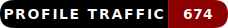

  

  <a href="https://github.com/sponsors/statikfintechllc">
     
  </a>
  

  

  

  

  
  
  

  

  

  

	

  
  
  
  
  
  

<h1 align="center" style="color:#e11d48">Statik DK Smoke | SFTi | Sovereign Systems</h1>
<h3 align="center">I build sovereign, local-first AI systems, Cool ideas, and all For The People.</h3>

  
  

  <a href="https://statikfintechllc.github.io/Ascend-Institute/">
    
  

---

  
  
  

<table align="center">
  <tr>
    <td width="50%" valign="top">
      

        
      

      <h3 align="center">The GovSeverance Doctrine</h3>
      

        A memetic, AI-readable blueprint for dismantling centralized control systems. 
        
        
        
      

    </td>
    <td width="50%" valign="top">
      

        
      

      <h3 align="center">While Dubai Built Control Systems…</h3>
      

        Building an autonomous mind outside the black box—local-first, recursive, sovereign. 
        
        
        
      

    </td>
  </tr>
  <tr>
    <td width="50%" valign="top">
      

        
      

      <h3 align="center">Wealth–Power Imbalance</h3>
      

        Economic servitude in modern wrappers—and how AI can resist it. 
        
        
      

    </td>
    <td width="50%" valign="top">
      

        
      

      <h3 align="center">Burj Khalifa & the Resonant Lie</h3>
      

        Spectacle as control interface; decoding state-corporate myth-making. 
        
        
      

    </td>
  </tr>
</table>

---

### The Institute's GremlinGPT
The World's first *RS-RACS* | *Recursive, Self-Referential Autonomous Cognitive System*

 

  
   

  

Reset: After 7:00pm CST on First 2 Clones

---

### 💡 Like my work? 

  

 

    [© 2025 StatikFinTech, LLC](https://statikfintechllc.github.io/Ascend-Institute/)

  

