   
  

  
  
  
  
  
  

   
  

  

  

  

  <a href="https://github.com/sponsors/statikfintechllc">
     
  </a>

  

<!-- Flexbox Grid -->

<!-- Zenodo Research Papers Flexbox Grid -->

  

  

  

  

<!-- Medium Articles Flexbox Grid -->

  

  

  

  

  

  

  

  

  

  

  

  

  

  

  

  

  
  
  

   
  <a href="https://statikfintechllc.github.io/Ascend-Institute/">
    
  

---

### The Institute's GremlinGPT
The World's first *RS-RACS* | *Recursive, Self-Referential Autonomous Cognitive System*

 

  
   

  

Reset: After 7:00pm CST on First 2 Clones

---

### 💡 Like my work? 

  

 

    [© 2025 StatikFinTech, LLC](https://statikfintechllc.github.io/Ascend-Institute/)

<!--

  

-->
